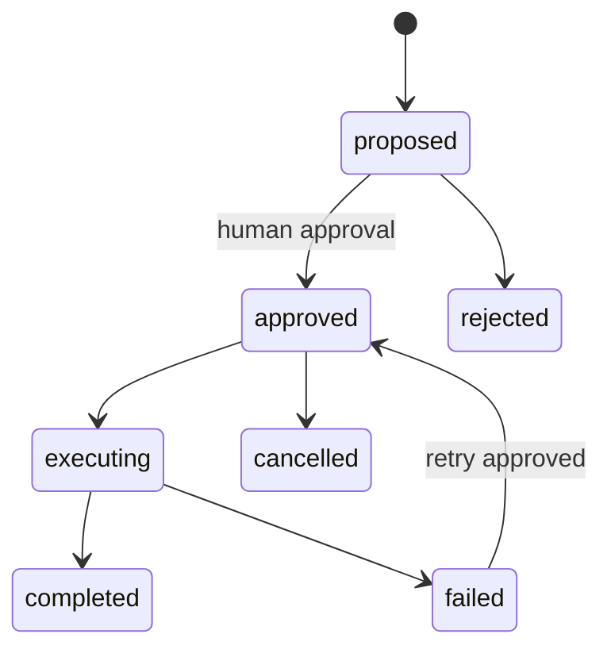

# CégMotor Business Automation Showcase

Sanitizált, futtatható kódminták egy több-bérlős vállalati munkatér biztonsági és AI-automatizációs rétegéből.

Az éles CégMotor lead-, ajánlat-, feladat-, számla-, csapat- és integrációs folyamatokat fog össze. Ez a repository nem tartalmaz ügyféladatot, éles kulcsot vagy a teljes tulajdonosi forráskódot; a legfontosabb mérnöki mintákat mutatja be.

## English summary

A sanitized, runnable showcase of security and AI-automation patterns from a multi-tenant business workspace. It demonstrates OAuth 2.0 PKCE, AES-GCM credential encryption, auditable state transitions and mandatory human approval before an AI-proposed action can execute.

## Bemutatott minták

- OAuth 2.0 PKCE verifier/challenge generálás;
- AES-GCM credential-titkosítás és visszafejtés;
- jóváhagyásos AI-agent állapotgép;
- auditálható állapotátmenetek;
- végrehajtás tiltása emberi jóváhagyás előtt.



## Teszt

Node.js 20+ szükséges, külső csomag nincs.

```bash
npm test
```

## Kapcsolódó technológiák az éles projektben

React · TypeScript · Cloudflare Workers · D1 · Drizzle ORM · REST API · OAuth · PKCE · AES-GCM · RBAC

- [Teljes portfólió](https://github.com/bianka20010221-crypto/ai-automation-portfolio)
- [CégMotor élő demó](https://cegmotor-app.bianka1717.chatgpt.site)
